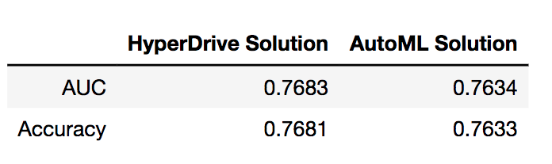
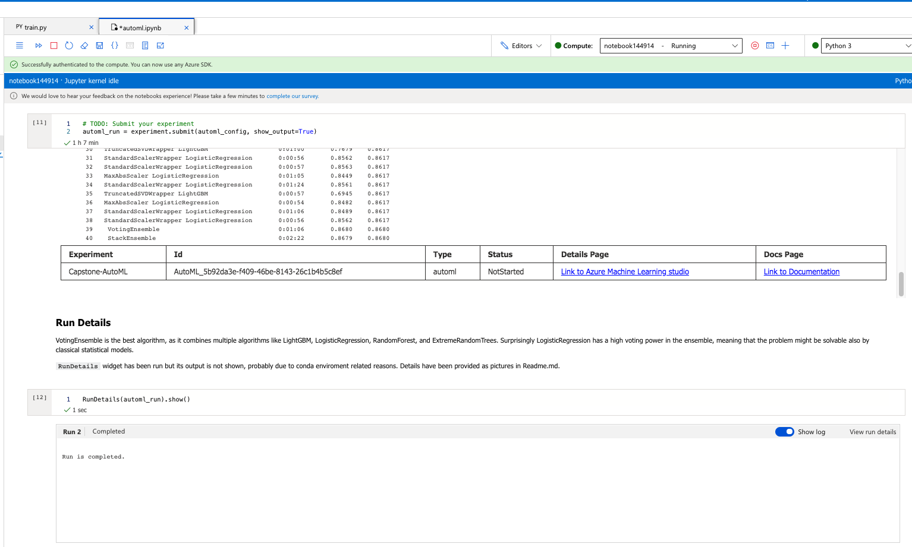
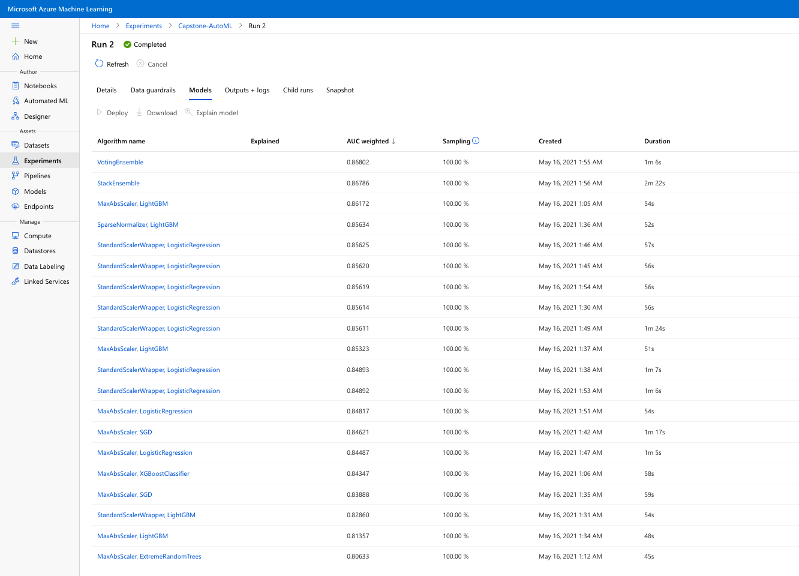
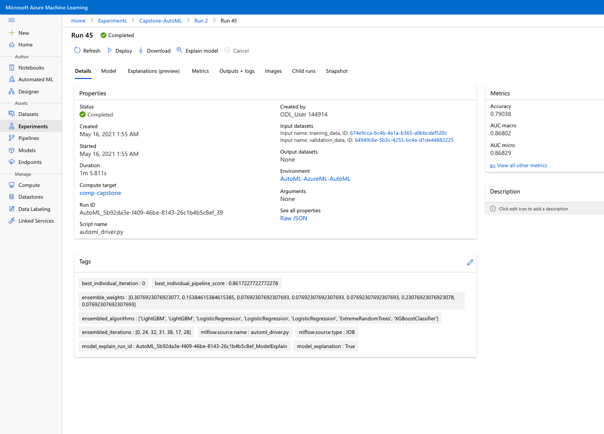
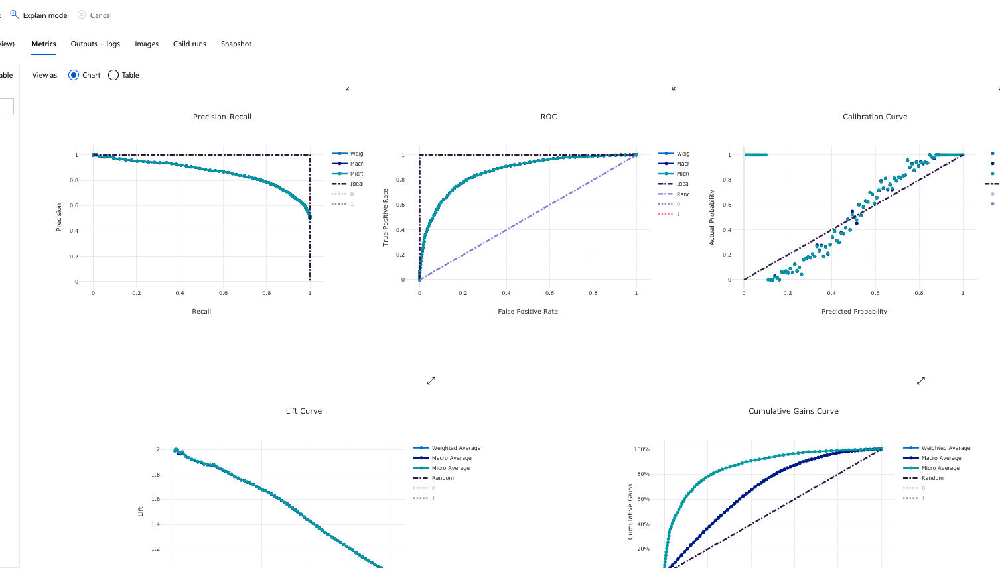
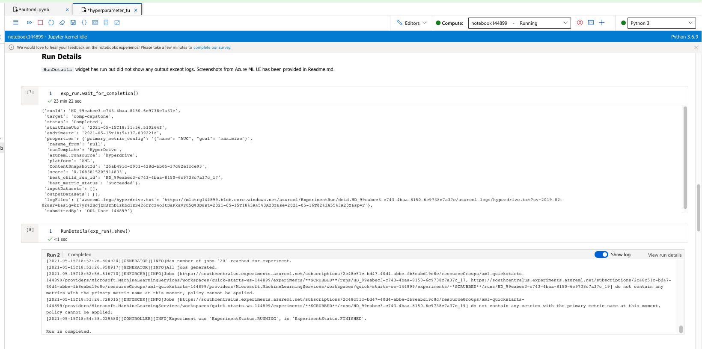
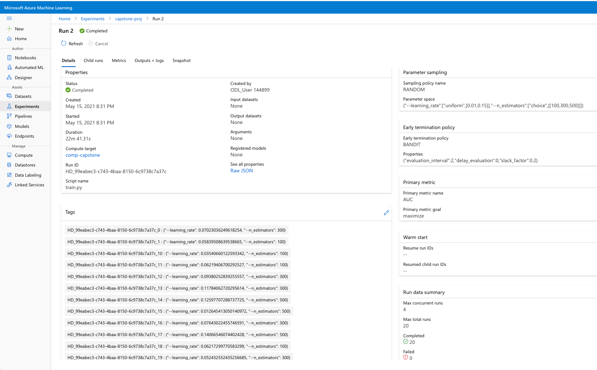
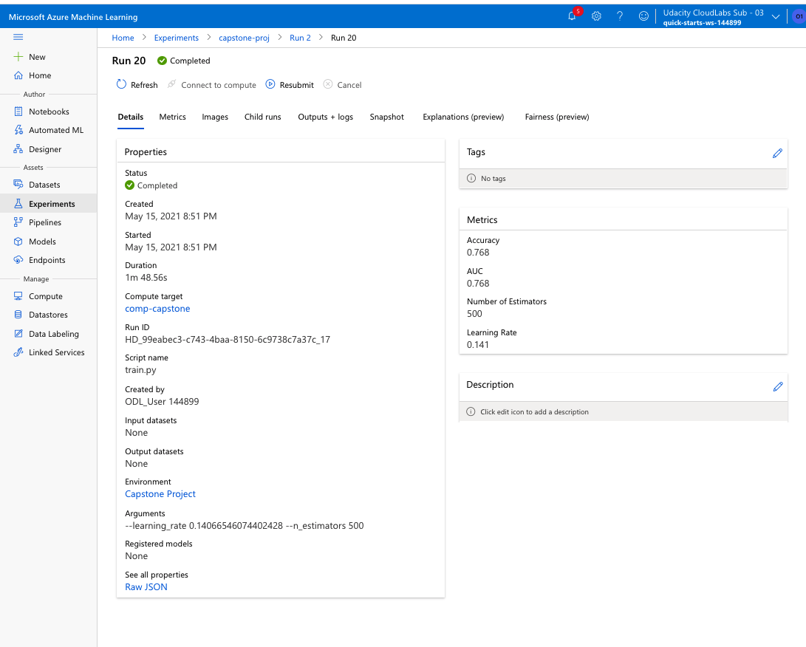
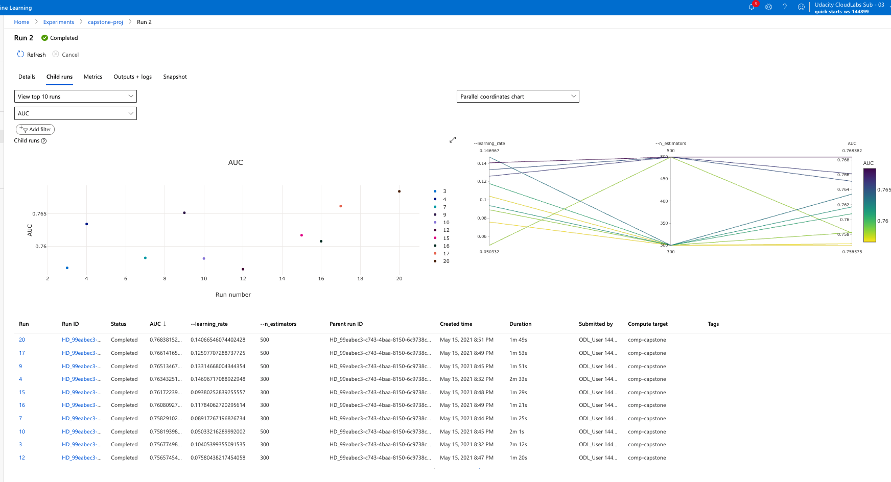
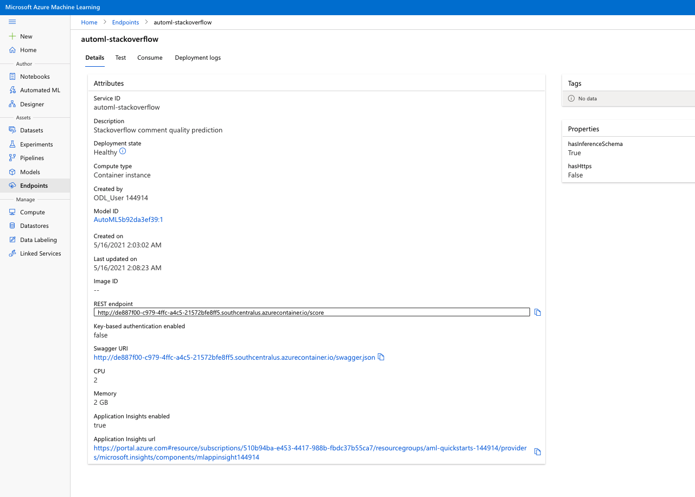

# Capstone - Azure Machine Learning Engineer
### Stackoverflow Question Quality Prediction, Batuhan Ipekci, 15.05.2021

This project outlines an attempt to predict Stackoverflow question quality, using Azure ML platform. Various features of the platform have been explored throughout the project, most notably AutoML, HyperDrive, and automated deployment. The HyperDrive solution has slightly better Accuracy and AUC (Area under ROC curve) scores than AutoML solution on out-of-bag test set. Although the AutoML solution looks like superior on the validation sets, we can discuss that it is slightly underperforming on an unseen test dataset. The AutoML model is deployed for demonstration purposes, and a sample data payload is sent as a Post request to the resulting endpoint.

Results on the oob test set for AutoML solution and HyperDrive solution

## Dataset

### Overview
A Kaggle dataset "60k Stack Overflow Questions with Quality Rating" has been used for this project. The dataset can be downloaded from the following link:
https://www.kaggle.com/imoore/60k-stack-overflow-questions-with-quality-rate. Questions from 2016-2020 are labelled in three categories (HQ, LQ_EDIT, LQ_CLOSE), according to their quality. 45000 rows are subsetted for the project. Title and Body of each question has been appended and considered as being a single text. This text has been used as the only predictor of quality, tags are ignored. For simplicity, the task has been reduced to a binary classification between HQ and LQ, meaning that LQ_EDIT and LQ_CLOSE have been aggregated to one class, LQ.

### Task
Binary classification of the texts have been made on a embedding matrix of word counts, the simplest embedding for the sake of lowering computational costs and not to lose the focus on MLDevOps. A simple preprocessing was applied to remove code brackets, simplify numbers and spaces, to lower word tokens. The least common words are removed during the implementation of CountVectorizer, where the minimum frequency is set to 0.025 to curb dimensionality. This also speeded up the AutoML featurization, and also model fitting in general. Those simplifications are quite practical, given the Udacity restrictions on the use of a temporary Azure account, which can persist up to 4 hours at most.

### Access
The access to the external dataset has been handled in Azure ML workspace. Two different approach is used to get the data in the proper format for HyperDrive and AutoML. For HyperDrive, the dataset is read from the csv files, transformed and fitted for the selected parameters. Azure Datastore is not used here, therefore it was inefficient in the sense that the data is read at each time when a set of parameters are tried. Using the datastore, and maybe setting up the project as two pipelines, one for reading and preparing the data and other for only model fitting, would increase the efficiency, hence the chance to try more parameters from the parameter space. Please refer to train.py for the complete data processing pipeline.

On the other hand, the Azure Datastore is utilized for implementing the AutoML solution. The data is at first read as a csv file, then the processed parts are saved in the local workspace. That local workspace folder is then uploaded to the default_datastore. As the last step, they are read again as a Tabular format. AutoML expects the data to be in this format to initalize featurization and model fitting. Having dealt the initial data reading and processing before the model fitting, AutoML has become a lot efficient as it has focussed only on the feature selection and modeling, rather than repeatedly reading and applying simple text mining to the dataset (That was the issue with HyperDrive process). Therefore, a wide range of models with different parameter setting have been applied. The implementation can be followed in automl.ipynb.

## Automated ML
The AutoML configurations are quite simple. The timeout is set to 50 minutes and the task is a (binary) classification. A separate validation dataset is provided for model selection within the AutoML module. The primary metric to optimize is AUC_weighted, as optimizing Area under the ROC curve also minimizes the true negatives and false positives in binary classification. Optimizing accuracy does not provide this feature by definition. The data has passed AzureML input guardrails, being a class-balanced dataset without missing values and high cardinality features.

### Results
The best results from AutoML process are obtained by a Voting Ensemble of 2 LightGBM with different settings, 3 LogisticRegression with different settings, XGBoostClassifier, and ExtremeRandomTrees. The voting power of those models are weighted by their individual performances on the validation dataset. LightGBM setups in total with 45% and LogisticRegression setups in total with 23%, and ExtremeRandomTrees with 23% of the weights dominate the decision making. AutoML is very useful to make the use of the best of the best models very easily. The validation accuracy of this ensemble is 0.79 and validation AUC score is 0.87.

The RunDetail widget has run but did not produce plots. Therefore, the screenshots of the Azure ML UI have also been included here.

The RunDetail widget:

The AutoML model ranking:

The best AutoML model as the Voting Ensemble:

The plots of the best AutoML solution. Observe that ROC curve is distant from the 45 degree line, distinguished from a random prediction:

## Hyperparameter Tuning

GradientBoostingClassifier from Scikit-learn has been used for the HyperDrive experiment. The reason was that it was quite easy to use, without requiring additional data wrappers and compatible model save capabilities (The most updated version of LightGBM does not allow to save models through pickle/joblib, so GradientBoostingClassifier resques us from the model-save-burden). It proved to be also a slightly better option than the voting ensemble from the AutoML (surprisingly), when tested on a separate out-of-bag test set. 

GradientBoostingClassifier is set with a validation fraction of 0.2, which was used for its own default early stopping rule. Two hyperparameters (learning_rate and n_estimators) are tuned to get the best result. The learning_rate is important to set up, as small learning rates might lead us stuck at infeasible regions during the optimization and large learning rates might jump over potentially good local optima. On the other hand, the number of base estimators (default base estimator type is a decision tree), n_estimators, would increase accuracy as it increases. However, there is a risk of overfitting with too many base estimators. Both hyperparamters are quite fundamental to be tuned. Please refer to train.py in order to explore the complete model fitting process.

Th Hyperparameter tuning is done through randomly picking the learning_rate from a uniform distribution between 0.01 and 0.15, while selecting n_estimators from a discrete set of (100, 300, 500). BanditPolicy has been used for early stopping, however it wasn't activated during the process, although the primary_metric_name is well-defined in logs. However, the default early-stopping policy of the classifier has been active.

### Results

The best performing model on the separate test set has learning_rate at 0.141 and n_estimators as 500. This setup has achieved 0.7667 AUC and 0.7665 Accuracy.
Later the AutoML choice has been compared the HyperDrive on the exact same test set (Observe that train_test_split() has been called in both notebooks with test_size=0.33 and random_state=42). HyperDrive solution has beaten the AutoML very slightly.

These results of HyperDrive can be improved further. In this project, only the most basic hyperparameters on a very restricted parameter space were tried. There are a lot to try out in gradient boosters like max_depth of base regressors, max_leaf_nodes, min_samples_leaf etc. A wider parameter space with more hyperparameters, and a perhaps a more efficient sampling (like Bayesian) would result in better accuracy and AUC scores.

The RunDetail widget:

The HyperDrive model ranking:

The best HyperDrive model with learning_rate:0.141 and n_estimators:500

The plots of the best HyperDrive solution. Observe that AUC gets always better with high n_estimators, regardless of different learning_rates.

## Model Deployment

Please check automl.ipynb for the details of the model deployment.

The AutoML model is deployed although it was beaten by HyperDrive on the out-of-the-bag test dataset. The reason was the idea of ensembling different algorithms. I personally prefer to combine multiple good performing models instead of relying on a single model. This strategy could yield decreasing the variance of the errors in the long term, during the production. Production is not a one-shot game, therefore we should not rely on just a single test dataset to make the final decision. Also, there wasn't a very big difference between the performances of the HyperDrive and AutoML solutions.

The deployment has done through (1) registering the best AutoML model, (2) Downloading the scoring script that is automatically provided by the Azure ML Run class. (3) The inference config has been built using the downloaded scoring script (score.py). This is quite important in defining what the endpoint excepts as a data and how it operates. Also the python environment (deploy_env) is also given. (4) AciWebservice has been initialized with a compute cluster of 2 CPU cores and 2 GB memory. (5) AciWebService, inference config, and the model has been deployed using the Model class of Azure ML.

Querying the endpoint: After the endpoint has been published, the status turned on to be "Healthy". The endpoint uri can either be obtained by printing the webservice object to the notebook cell, or from the Azure ML UI for endpoints. After the uri has been obtained, a sample data has been created by looping over the features. Then, a json payload object was serialized for the sample data and sent to the uri as a HTTP post request. The request has been successful, without any exceptions that are stated in the notebook. The resulting message was 1, meaning that the question is of high quality. 

Screenshot for the resulting endpoint:

Detailed view of the endpoint. Observe that Application Insights are enabled and status is healthy:

## Screen Recording
The following link on Youtube can be visited for a live demonstration of the endpoint:
https://www.youtube.com/watch?v=GEDGMv98OJE

The video contains:
- A working model
- Demo of the deployed  model
- Demo of a sample request sent to the endpoint and its response

## Standout Suggestions
* Enabling logging for the endpoint.

## Further Work

This project can be extended in multiple ways:

* More features can be extracted from the omitted tags column of the original dataset.
* A more suitable sequential algorithm like Bidirectional LSTM, or a transformer-based model like BERT can be implemented. Even further, the word embeddings can be enhanced through transfer learning from large pre-trained models.
* On the DevOps side, pipelines can be improved by defining the data reading and preparation step as separate from the model fitting step. That would make AutoML a lot efficient.
* The best models can be stored in ONNX format to be able to use it on multiple platforms.
* Key-based authentication can be enabled for a more secure application.
* Endpoint can be tested in terms of speed. 
* Endpoints can be further improved by accepting only the text, rather than the whole matrix of word embeddings. The tokenization and count-vectorization should be handled on the backend as a separate step in the pipeline.

